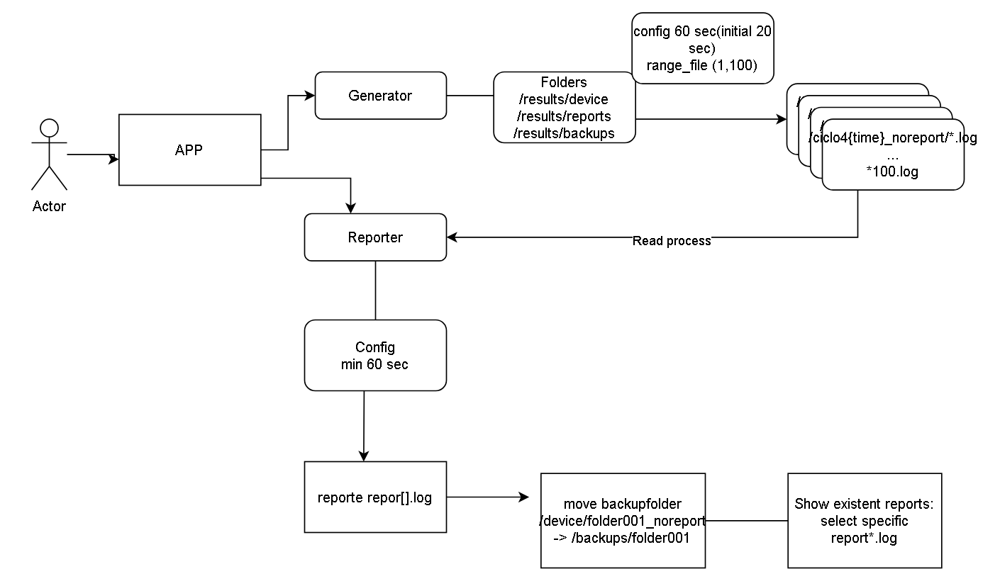

# NASA Apollo 11 - Sistema de Simulación y Monitoreo

Sistema de simulación y monitoreo para misiones espaciales NASA, desarrollado como parte del Python Bootcamp Challenge de Softserve.

## Sobre Este Proyecto

Este proyecto fue creado como ejercicio de aprendizaje para practicar conceptos de desarrollo en Python incluyendo:

- Programación orientada a objetos con clases y herencia
- Operaciones de archivos y gestión de directorios
- Gestión de configuración con YAML
- Testing unitario y property-based testing
- Parsing de argumentos CLI

El sistema simula un escenario real donde múltiples dispositivos en diferentes misiones espaciales generan datos de telemetría que necesitan ser recolectados, analizados y reportados.

## Descripción

Apollo 11 simula el monitoreo de dispositivos en misiones espaciales. Genera datos de telemetría simulados, analiza logs y produce reportes estadísticos en tiempo real.

**Características principales:**

- Generador de datos: Crea archivos de log simulados para diferentes misiones y dispositivos
- Analizador de reportes: Procesa logs y genera estadísticas de estado de dispositivos
- Gestión de backups: Archiva automáticamente los datos procesados
- Dashboard TUI: Interfaz visual en terminal para monitoreo en tiempo real (en desarrollo)

## Instalación

**Prerrequisitos:**

- Python 3.10+
- [Poetry](https://python-poetry.org/docs/#installation)

```bash
# Clonar el repositorio
git clone git@github.com:JoseJulianMosqueraFuli/apolo-11.git
cd apolo-11

# Instalar dependencias
poetry install

# Activar entorno virtual
poetry shell
```

## Uso

### Ejecución básica

```bash
# Con valores por defecto
poetry run python main.py

# Con parámetros personalizados
poetry run python main.py --num_files_min 1 --num_files_max 100 --generator_interval 5 --reporter_interval 15
```

### Parámetros CLI

| Parámetro              | Default | Descripción                                       |
| ---------------------- | ------- | ------------------------------------------------- |
| `--num_files_min`      | 1       | Número mínimo de archivos log a generar por ciclo |
| `--num_files_max`      | 100     | Número máximo de archivos log a generar por ciclo |
| `--generator_interval` | 20      | Tiempo en segundos entre cada ciclo de generación |
| `--reporter_interval`  | 60      | Tiempo en segundos entre cada ciclo de reportes   |

**Nota:** El intervalo de reportes debe ser mayor que el intervalo del generador. El sistema ejecuta múltiples ciclos de generación antes de cada ciclo de reportes.

### Ejecutar tests

```bash
# Tests con cobertura
poetry run pytest --cov=apolo_11

# Tests verbose
poetry run pytest -v
```

## Estructura del Proyecto

```
apolo-11/
├── apolo_11/
│   ├── config/
│   │   └── config.yaml      # Configuración del sistema
│   └── src/
│       ├── classes.py       # Clases Mission y Device
│       ├── config.py        # ConfigManager
│       ├── generator.py     # Generador de logs
│       └── reporter.py      # Procesador de reportes
├── tests/
│   └── tests_src/           # Tests unitarios y de propiedades
├── docs/
│   └── images/              # Diagramas y documentación visual
├── main.py                  # Punto de entrada
└── pyproject.toml           # Dependencias del proyecto
```

## Arquitectura




## Configuración

El archivo `apolo_11/config/config.yaml` contiene la configuración del sistema:

- Misiones disponibles y sus códigos
- Tipos de dispositivos y estados
- Rutas de directorios
- Formato de fechas
- Intervalos de generación/reporte

## Limitaciones Conocidas

- El intervalo de reportes siempre debe ser mayor que el intervalo del generador. Si los archivos se generan más rápido de lo que pueden procesarse, los datos pueden acumularse.
- El sistema no maneja acceso concurrente a archivos de log. No se soporta ejecutar múltiples instancias simultáneamente.
- El manejo de errores durante el procesamiento de archivos es básico; archivos de log malformados pueden causar problemas.

## Mejoras en Desarrollo

- Corrección de bugs en `move_folders_to_backup`
- Mejora de cobertura de tests
- Dashboard TUI con Rich
- Logging centralizado y configurable
- Procesamiento paralelo con threads/async

## Licencia

Este proyecto está bajo la [Licencia MIT](LICENSE).

## Autores

Desarrollado por Alejandra Quiroz Gómez, Sara Palacio y Jose Julian Mosquera Fuli.
