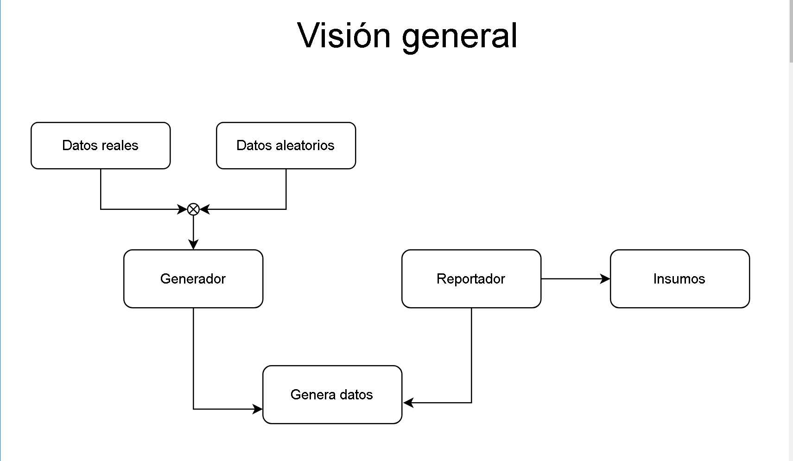
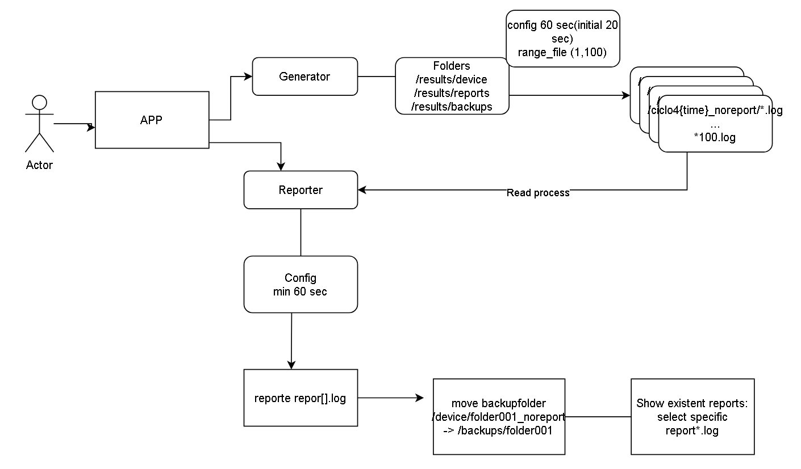
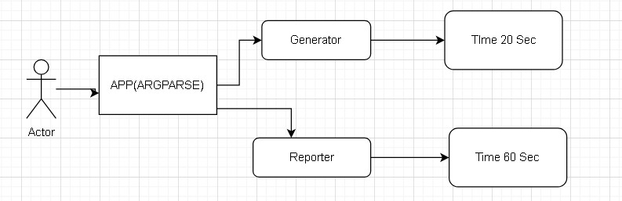

# NASA Apollo 11 Python Bootcamp Challenge

This repository is part of the Python Bootcamp NASA challenge, known as Apollo 11. It implements a Simulation and Monitoring System designed to simulate a monitoring system for NASA's crucial Apollo 11 mission.

## Overview

The system performs the following tasks:

1. Generates simulated device data logs for various NASA missions.
2. Analyzes log data and computes statistics for mission-critical reporting.
3. Manages data logs, storage, and archiving processes.
4. Outputs a visual dashboard for tracking device status.

We assume that the time for reporter always be mayor than the time to generate files, this case could be an improvement in future releases, and for this case we not control the possibility of error.

## Index

- [Getting Started](#getting-started)
- [Project Structure](#project-structure)
- [Considerations](#considerations)
- [License](#license)
- [Authors](#authors)

## Getting Started

1. Clone the repository:

   ```bash
   git clone git@github.com:JoseJulianMosqueraFuli/apolo-11.git
   ```

   > [!NOTE]  
   > If you don't have installed poetry, please check this link [poetry-install](https://github.com/python-poetry/install.python-poetry.org) to install.

   > <b>Check with

   ```bash
   Poetry --version
   ```

   </b>

2. Navigate to the apolo11

   ```bash
   cd apolo-11/
   ```

   > [!IMPORTANT]
   >
   > - The project uses a configuration file `config/config.yml` where you can find various settings for the simulation and monitoring system. It includes details about missions, codes, date formats, and other relevant parameters. Refer to the [config file](apolo_11/config/config.yaml) for more information.

3. Installation dependencies with Poetry

   ```bash
   Poetry install
   ```

4. Activate environment

   ```bash
   Poetry shell
   ```

5. Run App, with require values.

   ```bash
   poetry run python3 main.py --num_files_min 1 --num_files_max 100 --generator_interval 5 --reporter_interval 15
   or
   ################################
   # With default values
   python3 run python3 main.py
   ```

6. Run the coverage

   ```bash
   poetry run pytest --cov=apolo_11
   ```

## Project Structure

Proposal general diagram:



Proposal key folders and files:

```linux
apolo-11/
|
|-- config/
|   |-- config.yml
|-- src/
|   |-- classes.py
|   |-- reporter.py
|   |-- generator.py
|   |-- config.py
|   |-- __init__.py
|
|-- tests/
|   |-- test.py
|
|-- results/
|   |-- devices/
|   |-- backups/
|   |-- reports/
|
|-- docs/
|
|-- setup.cfg
|-- main.py
|-- .gitignore
|-- License
|-- poetry.lock
|-- Readme.md
|-- pyproject.toml
```




## considerations

Here are some things that we consider to add next:

- Create \*.log files from Logger configuration
- Alternatives to parallel processing using Threads or Async.
- Improve testing performance, because last changes break it.
- Always could be improve

## License

This project is licensed under the [MIT License](LICENSE).

## Authors

Built by Alejandra Quiroz Gómez, Sara Palacio and Jose Julian Mosquera Fuli.
