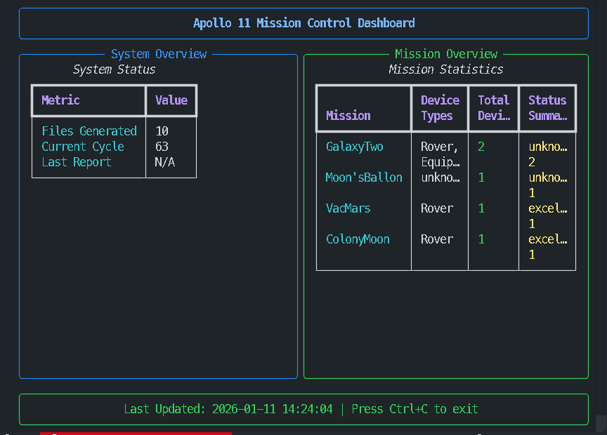
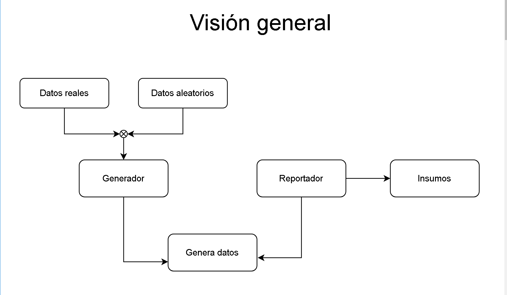
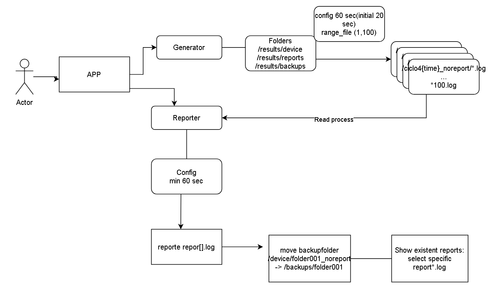

<div align="center">


# 🚀 NASA Apollo 11 - Simulation and Monitoring System

[](https://www.python.org/downloads/)
[](https://python-poetry.org/)
[](https://github.com/JoseJulianMosqueraFuli/apolo-11/actions/workflows/ci.yml)
[](tests/)
[](htmlcov/)
[](LICENSE)

_A professional simulation and monitoring system for NASA space missions_

[English](README.md) • [Español](README.es.md)

</div>

---

## 📋 Table of Contents

- [About](#-about)
- [Features](#-features)
- [Installation](#-installation)
- [Usage](#-usage)
- [Dashboard](#-dashboard-tui)
- [Architecture](#-architecture)
- [Testing](#-testing)
- [Configuration](#-configuration)
- [Contributing](#-contributing)
- [License](#-license)

## 🎯 About

Apollo 11 is a comprehensive simulation and monitoring system designed for NASA space missions. Built with modern Python practices, it provides real-time telemetry data generation, analysis, and reporting capabilities with a beautiful terminal user interface.

**Developed as part of the Softserve Python Bootcamp Challenge**, this project demonstrates advanced Python concepts including:

- 🏗️ **Object-oriented programming** with classes and inheritance
- 📁 **File I/O operations** and directory management
- ⚙️ **Configuration management** with YAML
- 🧪 **Comprehensive testing** (unit tests + property-based testing)
- 🖥️ **CLI interface** with argument parsing
- 📊 **Real-time dashboard** with Rich library

The system simulates real-world scenarios where multiple devices across different space missions generate telemetry data that needs to be collected, analyzed, and reported in real-time.

## ✨ Features

Apollo 11 provides a complete suite of tools for space mission monitoring:

### 🔧 Core Components

- **📊 Data Generator**: Creates realistic simulated log files for different missions and devices
- **📈 Report Analyzer**: Processes logs and generates comprehensive device status statistics
- **💾 Backup Management**: Automatically archives processed data with intelligent folder handling
- **🖥️ TUI Dashboard**: Beautiful terminal interface for real-time monitoring using Rich library

### 🚀 Advanced Capabilities

- **Real-time Monitoring**: Live updates of system status and mission statistics
- **Property-based Testing**: Robust validation using Hypothesis framework
- **Centralized Logging**: Configurable logging system across all modules
- **High Test Coverage**: 98% test coverage with 45 comprehensive tests
- **Professional CLI**: Full argument parsing with validation and help system

## 🛠️ Installation

### Prerequisites

- **Python 3.10+** - [Download here](https://www.python.org/downloads/)
- **Poetry** - [Installation guide](https://python-poetry.org/docs/#installation)

### Quick Start

```bash
# 1. Clone the repository
git clone git@github.com:JoseJulianMosqueraFuli/apolo-11.git
cd apolo-11

# 2. Install dependencies
poetry install

# 3. Run with dashboard (recommended)
poetry run apolo --dashboard
```

### Verify Installation

```bash
# Run tests to verify everything works
poetry run pytest --cov=apolo_11 -v
```

## 🚀 Usage

### Basic Execution

```bash
# Default configuration
poetry run apolo

# Custom parameters
poetry run apolo --num_files_min 1 --num_files_max 100 --generator_interval 5 --reporter_interval 15

# Enable dashboard for real-time monitoring (recommended)
poetry run apolo --dashboard
```

### Command Line Parameters

| Parameter              | Default | Description                                          |
| ---------------------- | ------- | ---------------------------------------------------- |
| `--num_files_min`      | 1       | Minimum number of log files to generate per cycle    |
| `--num_files_max`      | 100     | Maximum number of log files to generate per cycle    |
| `--generator_interval` | 20      | Time in seconds between each file generation cycle   |
| `--reporter_interval`  | 60      | Time in seconds between each report generation cycle |
| `--dashboard`          | False   | Enable TUI dashboard for real-time monitoring        |

> **⚠️ Important:** The reporter interval must be greater than the generator interval to prevent data accumulation.

## 📊 Dashboard TUI

The system features a beautiful Terminal User Interface (TUI) dashboard built with the Rich library for real-time monitoring:

<div align="center">



_Real-time monitoring dashboard with live statistics_

</div>

### 🎛️ Dashboard Features

#### System Overview Panel

- **📁 Files Generated**: Total log files created in current session
- **🔄 Current Cycle**: Active generation cycle number
- **⏰ Last Report**: Timestamp of most recent statistical report

#### Mission Statistics Panel

- **🚀 Mission Names**: Active space missions (GalaxyTwo, ColonyMoon, VacMars, etc.)
- **🔧 Device Types**: Device categories per mission (Rover, Equipment, Sensor, etc.)
- **📊 Device Counts**: Total devices per mission
- **✅ Status Summary**: Device status distribution (operational, excellent, unknown, etc.)

#### Real-time Updates

- ⚡ **Auto-refresh**: Updates every second automatically
- 📡 **Live Data**: Direct feed from generator and reporter components
- 🎨 **Clean Layout**: Professional interface using Rich library
- ⌨️ **Easy Exit**: Press `Ctrl+C` to exit gracefully

### Enable Dashboard

```bash
# Recommended settings for optimal dashboard experience
poetry run apolo --dashboard --generator_interval 3 --reporter_interval 10
```

## 🏗️ Architecture

The system follows a modular architecture with clear separation of concerns:

<div align="center">



_High-level system architecture_



_Detailed component interactions_

</div>

### 📁 Project Structure

```
apolo-11/
├── 📁 apolo_11/
│   ├── 📁 config/
│   │   └── 📄 config.yaml      # System configuration
│   └── 📁 src/
│       ├── 📄 classes.py       # Mission and Device classes
│       ├── 📄 config.py        # ConfigManager
│       ├── 📄 dashboard.py     # TUI Dashboard with Rich
│       ├── 📄 generator.py     # Log generator
│       ├── 📄 logging_config.py # Centralized logging
│       └── 📄 reporter.py      # Report processor
├── 📁 tests/
│   └── 📁 tests_src/           # Unit and property tests
├── 📁 docs/
│   └── 📁 images/              # Diagrams and visual documentation
├── 📄 main.py                  # Entry point (delegates to apolo_11.cli)
└── 📄 pyproject.toml           # Project dependencies
```

## 🧪 Testing

The project maintains high code quality with comprehensive testing:

### Test Coverage

- **✅ 48 Tests Passing**: All tests pass consistently
- **📊 98% Coverage**: Excellent test coverage across all modules
- **🔬 Property-Based Testing**: Using Hypothesis for robust validation
- **🧪 Unit Testing**: Comprehensive unit tests for all components

### Run Tests

```bash
# Run all tests with coverage report
poetry run pytest --cov=apolo_11 --cov-report=term-missing --cov-report=html

# Run tests in verbose mode
poetry run pytest -v

# Run specific test file
poetry run pytest tests/tests_src/test_dashboard.py -v

# Generate HTML coverage report
poetry run pytest --cov=apolo_11 --cov-report=html
# Open htmlcov/index.html in browser
```

### Test Types

- **Unit Tests**: Test individual components and functions
- **Property-Based Tests**: Test universal properties using Hypothesis
- **Integration Tests**: Test component interactions
- **Edge Case Tests**: Test error conditions and boundary cases

## ⚙️ Configuration

The system is highly configurable through the `apolo_11/config/config.yaml` file:

### Configuration Options

```yaml
# Mission definitions
missions:
  codes:
    OrbitOne: ORBONE
    GalaxyTwo: GALXTWO
  names:
    - OrbitOne
    - GalaxyTwo

# Device specifications
devices:
  types:
    - Satellite
    - Rover
  status:
    - excellent
    - good
    - warning

# System settings
general:
  num_files_initial: 1
  num_files_final: 100
  time_cycle: 20

# Logging configuration
logging:
  level: INFO
  format: "%(asctime)s - %(name)s - %(levelname)s - %(message)s"

# Directory paths
routes:
  results: ./apolo_11/results
  devices: ./apolo_11/results/devices
  backups: ./apolo_11/results/backups/
  reports: ./apolo_11/results/reports/
```

### Customization

- **Missions**: Add new space missions and their codes
- **Devices**: Define device types and status options
- **Logging**: Configure log levels and formats
- **Paths**: Customize directory structure
- **Intervals**: Set generation and reporting frequencies

## ⚠️ Known Limitations

- **Timing Constraints**: Reporter interval must exceed generator interval to prevent data accumulation
- **Concurrency**: No support for multiple simultaneous instances accessing the same log files
- **Error Handling**: Basic error handling for malformed log files may need enhancement
- **Resource Usage**: Large datasets may require additional memory optimization

## 🚧 Recent Improvements

- ✅ **Architecture**: Eliminated side-effect imports — no IO at module load time
- ✅ **Dependency Injection**: All components accept optional config, testable without mocks
- ✅ **Config Stability**: Routes changed from fragile list indices to dict keys
- ✅ **Package Safety**: State file moved out of package source to results directory
- ✅ **CLI Entry Point**: `apolo` command works after `pip install` (no more `python main.py`)
- ✅ **CI/CD**: GitHub Actions with matrix testing across Python 3.10–3.12
- ✅ **Security**: Patched pytest (CVE-2024-11305) and Pygments (CVE-2024-43791)
- ✅ **Logging**: No longer stomps on root logger — safe as a library
- ✅ **SIGTERM Handling**: Graceful shutdown on kill signal
- 🔄 **Future**: Parallel processing with threads/async (in development)

## 🤝 Contributing

We welcome contributions! Please see our contributing guidelines:

1. **Fork** the repository
2. **Create** a feature branch (`git checkout -b feature/amazing-feature`)
3. **Commit** your changes (`git commit -m 'Add amazing feature'`)
4. **Push** to the branch (`git push origin feature/amazing-feature`)
5. **Open** a Pull Request

### Development Setup

```bash
# Clone your fork
git clone git@github.com:yourusername/apolo-11.git
cd apolo-11

# Install development dependencies
poetry install --with dev

# Run tests before committing
poetry run pytest --cov=apolo_11

# Run linting
poetry run flake8 apolo_11/
```

## 📄 License

This project is licensed under the [MIT License](LICENSE) - see the LICENSE file for details.

## 👥 Authors

<div align="center">

**Built with ❤️ by:**

🚀 **Alejandra Quiroz Gómez** • **Sara Palacio** • **Jose Julian Mosquera Fuli**

_Softserve Python Bootcamp Challenge_

---

<div align="center">

**⭐ Star this repository if you found it helpful!**

[🐛 Report Bug](https://github.com/JoseJulianMosqueraFuli/apolo-11/issues) • [✨ Request Feature](https://github.com/JoseJulianMosqueraFuli/apolo-11/issues) • [📖 Documentation](docs/)

</div>

</div>
